# Results

## samples/leaked/001.txt:

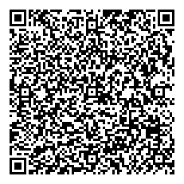

```plain
Certificate is INVALID!
level=fatal msg="unable to verify certificate: public key for kid=GO0rf1TneQQ= not found"
---
VR 0: C=PL,ID=URN:UVCI:01:PL:1/7934E5C11DAD485F9F27B20DA5A41082,ISS=Centrum e-Zdrowia
KID: GO0rf1TneQQ=
Issued At: 2021-05-24 22:00:00 UTC
Expiration: 2022-05-17 22:00:00 UTC
Personal Name: Stanisław Rogaliński-Król
DOB: 1958-11-11
```

## samples/leaked/002.txt:

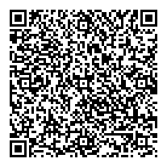

```plain
Certificate is INVALID!
level=fatal msg="unable to verify certificate: public key for kid=Qk9HVVNLSUQ= not found"
---
VR 0: C=DE,ID=URN:UVCI:01DE/GDATA/FAKECERTIFICATE#0,ISS=Institute for Snake Oil Cryptography
KID: 
Issued At: 1999-12-31 23:00:00 UTC
Expiration: 2021-11-30 23:00:00 UTC
Personal Name: Robert Koch
DOB: 1843-12-11
```

## samples/leaked/003.txt:


```plain
VR 0: C=DE,ID=URN:UVCI:01DE/IZ14482A/2BYU1VFE8L2JDQJHY1QVSK#E,ISS=Robert Koch-Institut
KID: dhSzPDr4G2M=
Issued At: 2021-05-26 11:29:31 UTC
Signed By: SERIALNUMBER=CSM026164168,CN=Robert Koch-Institut,OU=Elektronischer Impfnachweis,O=Robert Koch-Institut,POSTALCODE=13353,STREET=Nordufer 20,L=Berlin,ST=Berlin,C=DE,2.5.4.97=#131044543a44452d33303233353331343435 (issued by: CN=D-TRUST CA 2-2 2019,O=D-Trust GmbH,C=DE,2.5.4.97=#130e4e545244452d4852423734333436)
Expiration: 2022-05-26 11:29:31 UTC
Personal Name: Bernd Brandenburgtest
DOB: 1950-01-01
```

## samples/leaked/004.txt:

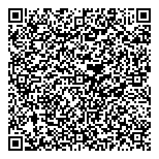

```plain
Certificate is INVALID!
level=fatal msg="unable to decode certificate: flate: corrupt input before offset 31. Make sure you provided a valid certificate in textual form."
---
```

## samples/leaked/005.txt:

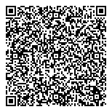

```plain
VR 0: C=DE,ID=URN:UVCI:01DE/A22011741/44I7RC30ESZ54KX83G1KCG#L,ISS=Robert Koch-Institut
KID: XkVWZqUeeFc=
Issued At: 2021-06-18 08:58:51 UTC
Signed By: SERIALNUMBER=CSM026460026,CN=Robert Koch-Institut,OU=Elektronischer Impfnachweis,O=Robert Koch-Institut,POSTALCODE=13353,STREET=Nordufer 20,L=Berlin,ST=Berlin,C=DE,2.5.4.97=#131044543a44452d33303233353331343435 (issued by: CN=D-TRUST CA 2-2 2019,O=D-Trust GmbH,C=DE,2.5.4.97=#130e4e545244452d4852423734333436)
Expiration: 2022-06-18 08:58:51 UTC
Personal Name: Matthias Walter Stolt
DOB: 1954-05-06
```

## samples/leaked/006.txt:

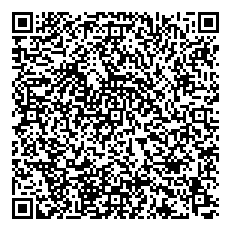

```plain
VR 0: C=DE,ID=URN:UVCI:01DE/A68013692/57T5LBZC87W21TTS90HNHO#W,ISS=Robert Koch-Institut
KID: XkVWZqUeeFc=
Issued At: 2021-07-01 08:06:03 UTC
Signed By: SERIALNUMBER=CSM026460026,CN=Robert Koch-Institut,OU=Elektronischer Impfnachweis,O=Robert Koch-Institut,POSTALCODE=13353,STREET=Nordufer 20,L=Berlin,ST=Berlin,C=DE,2.5.4.97=#131044543a44452d33303233353331343435 (issued by: CN=D-TRUST CA 2-2 2019,O=D-Trust GmbH,C=DE,2.5.4.97=#130e4e545244452d4852423734333436)
Expiration: 2022-07-01 08:06:03 UTC
Personal Name: Christopher Frank
DOB: 1978-06-30
```

## samples/leaked/007.txt:

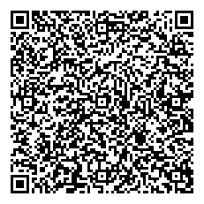

```plain
VR 0: C=DE,ID=URN:UVCI:01DE/DAVPU/4NT01NOI9BRSW4T736ASY5#H,ISS=Robert Koch-Institut
KID: XkVWZqUeeFc=
Issued At: 2021-06-15 07:54:17 UTC
Signed By: SERIALNUMBER=CSM026460026,CN=Robert Koch-Institut,OU=Elektronischer Impfnachweis,O=Robert Koch-Institut,POSTALCODE=13353,STREET=Nordufer 20,L=Berlin,ST=Berlin,C=DE,2.5.4.97=#131044543a44452d33303233353331343435 (issued by: CN=D-TRUST CA 2-2 2019,O=D-Trust GmbH,C=DE,2.5.4.97=#130e4e545244452d4852423734333436)
Expiration: 2022-06-15 07:54:17 UTC
Personal Name: Christina Schröer
DOB: 1989-12-23
```

## samples/leaked/008.txt:

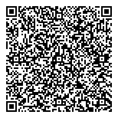

```plain
VR 0: C=PL,ID=URN:UVCI:01:PL:1/249F3DAB2AD64C3CB8DA631B1D07FC4A,ISS=Centrum e-Zdrowia
KID: HhkeqvrtQ0U=
Issued At: 2021-06-02 07:58:56 UTC
Signed By: CN=Poland Vaccination DGC Service 1,OU=eHealth Centre,O=Ministry of Health,C=PL (issued by: CN=Poland DGC RootCSCA 1,O=Ministry of Health,C=PL)
Expiration: 2022-05-31 14:00:00 UTC
Personal Name: AGNIESZKA KATARZYNA KATRYNICZ
DOB: 1973-11-25
```

## samples/leaked/009.txt:


```plain
VR 0: C=PL,ID=URN:UVCI:01:PL:1/D7FE110D1B7E4FFA875525D3454D99C2,ISS=Centrum e-Zdrowia
KID: HhkeqvrtQ0U=
Issued At: 2021-06-21 17:58:52 UTC
Signed By: CN=Poland Vaccination DGC Service 1,OU=eHealth Centre,O=Ministry of Health,C=PL (issued by: CN=Poland DGC RootCSCA 1,O=Ministry of Health,C=PL)
Expiration: 2023-05-26 11:53:10 UTC
Personal Name: MICHAŁ PIOTR KOŚĆ
DOB: 1965-05-19
```

## samples/leaked/010.txt:

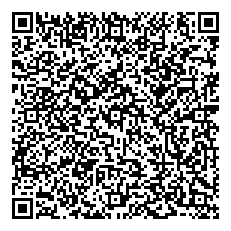

```plain
VR 0: C=PL,ID=URN:UVCI:01:PL:1/4AD6677CEA4E4248AEF7346EF0BD381D,ISS=Centrum e-Zdrowia
KID: HhkeqvrtQ0U=
Issued At: 2021-06-01 07:52:50 UTC
Signed By: CN=Poland Vaccination DGC Service 1,OU=eHealth Centre,O=Ministry of Health,C=PL (issued by: CN=Poland DGC RootCSCA 1,O=Ministry of Health,C=PL)
Expiration: 2022-05-07 11:51:00 UTC
Personal Name: ANDRZEJ BORTNOWSKI
DOB: 1959-07-31
```

## samples/leaked/011.txt:

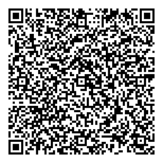

```plain
VR 0: C=PL,ID=URN:UVCI:01:PL:1/38B8CEDE3BF847F5A48211137294E4B1,ISS=Centrum e-Zdrowia
KID: HhkeqvrtQ0U=
Issued At: 2021-06-01 10:58:21 UTC
Signed By: CN=Poland Vaccination DGC Service 1,OU=eHealth Centre,O=Ministry of Health,C=PL (issued by: CN=Poland DGC RootCSCA 1,O=Ministry of Health,C=PL)
Expiration: 2022-02-08 09:39:00 UTC
Personal Name: TOMASZ JAN TROJANOWSKI
DOB: 1966-10-16
```

## samples/leaked/012.txt:


```plain
VR 0: C=IT,ID=01IT980F991939DA45AF8448E3BF484FA56D#5,ISS=Ministero della Salute
KID: NJpCsMLQco4=
Issued At: 2021-06-22 01:53:35 UTC
Signed By: CN=Italy DGC DSC 1,O=Ministero della Salute,C=IT (issued by: CN=Italy DGC CSCA 1,O=Ministero della Salute,C=IT)
Expiration: 2023-05-12 00:00:00 UTC
Personal Name: PAOLO GALASSO
DOB: 1989-02-02
```

## samples/leaked/013.txt:

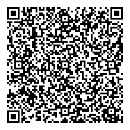

```plain
VR 0: C=IT,ID=01ITECDAC695DB4A44CCBAD6DCF1E88079CE#4,ISS=Ministero della Salute
KID: NJpCsMLQco4=
Issued At: 2021-06-18 20:13:32 UTC
Signed By: CN=Italy DGC DSC 1,O=Ministero della Salute,C=IT (issued by: CN=Italy DGC CSCA 1,O=Ministero della Salute,C=IT)
Expiration: 2023-05-12 00:00:00 UTC
Personal Name: MARIO VECCHIO
DOB: 1960-02-06
```

## samples/leaked/014.txt:

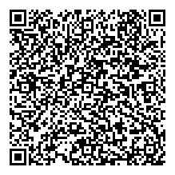

```plain
VR 0: C=IT,ID=01IT1ED03BC0991F42379C29A08C2CA1377A#1,ISS=Ministero della Salute
KID: NJpCsMLQco4=
Issued At: 2021-06-19 12:55:12 UTC
Signed By: CN=Italy DGC DSC 1,O=Ministero della Salute,C=IT (issued by: CN=Italy DGC CSCA 1,O=Ministero della Salute,C=IT)
Expiration: 2023-05-12 00:00:00 UTC
Personal Name: NICODEMO GAGLIARDI
DOB: 1955-06-09
```

## samples/leaked/015.txt:


```plain
VR 0: C=IT,ID=01IT4A89CA25D9BD47B0B8E0EA45895EEFCF#2,ISS=Ministero della Salute
KID: NJpCsMLQco4=
Issued At: 2021-08-21 09:01:40 UTC
Signed By: CN=Italy DGC DSC 1,O=Ministero della Salute,C=IT (issued by: CN=Italy DGC CSCA 1,O=Ministero della Salute,C=IT)
Expiration: 2023-05-12 00:00:00 UTC
Personal Name: ANDREA GIANNETTI
DOB: 1993-02-16
```

## samples/leaked/016.txt:

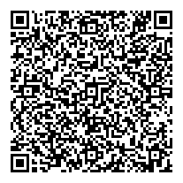

```plain
VR 0: C=FR,ID=urn:uvci:01:FR:8LWMU27O76AZ#0,ISS=CNAM
KID: fGLuvg6n5wk=
Issued At: 2021-07-09 15:43:56 UTC
Signed By: CN=DSC_FR_019,OU=180035024,O=CNAM,C=FR (issued by: CN=CSCA-FRANCE,O=Gouv,C=FR)
Expiration: 2023-06-13 22:00:00 UTC
Personal Name: REGIS FABLET
DOB: 1972-07-29
```

## samples/leaked/017.txt:

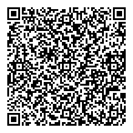

```plain
VR 0: C=FR,ID=urn:uvci:01:FR:PXEZC1B08PI5#T,ISS=CNAM
KID: fGLuvg6n5wk=
Issued At: 2021-07-03 04:59:03 UTC
Signed By: CN=DSC_FR_019,OU=180035024,O=CNAM,C=FR (issued by: CN=CSCA-FRANCE,O=Gouv,C=FR)
Expiration: 2023-06-13 22:00:00 UTC
Personal Name: RICHARD GERARD BOUHET
DOB: 1955-02-16
```

## samples/leaked/018.txt:

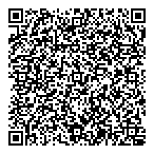

```plain
Certificate is INVALID!
level=fatal msg="unable to decode certificate: cbor.Unmarshal(v.Payload): cbor: cannot unmarshal primitives into Go struct field coronaqr.claims.4 of type int64. Make sure you provided a valid certificate in textual form."
---
```

## samples/leaked/019.txt:

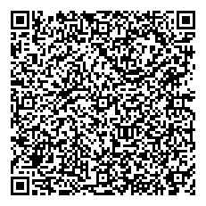

```plain
Certificate is INVALID!
level=fatal msg="unable to verify certificate: public key for kid=Rjene8QvRwA= not found"
---
VR 0: C=NL,ID=urn:uvci:01:NL:PLA8UWS60Z4RZXVALL6GAZ,ISS=Ministry of VWS
VR 1: C=NL,ID=urn:uvci:01:NL:ATS342XDYS358FDFH3GTK5,ISS=Ministry of VWS
KID: Rjene8QvRwA=
Issued At: 2021-09-25 07:47:24 UTC
Expiration: 2025-09-25 07:47:24 UTC
Personal Name: Путин Владимир
DOB: 2009-02-28
```

## samples/leaked/020.txt:

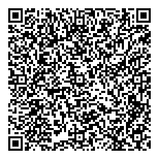

```plain
Certificate is INVALID!
level=fatal msg="unable to decode certificate: flate: corrupt input before offset 74. Make sure you provided a valid certificate in textual form."
---
```

## samples/leaked/021.txt:

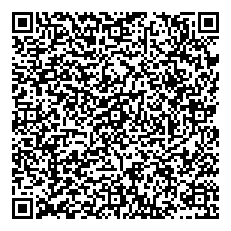

```plain
VR 0: C=DE,ID=URN:UVCI:01DE/A70008644/35HMBQG7OD7IKJNTAIT54I#H,ISS=Robert Koch-Institut
KID: XkVWZqUeeFc=
Issued At: 2021-06-16 07:01:26 UTC
Signed By: SERIALNUMBER=CSM026460026,CN=Robert Koch-Institut,OU=Elektronischer Impfnachweis,O=Robert Koch-Institut,POSTALCODE=13353,STREET=Nordufer 20,L=Berlin,ST=Berlin,C=DE,2.5.4.97=#131044543a44452d33303233353331343435 (issued by: CN=D-TRUST CA 2-2 2019,O=D-Trust GmbH,C=DE,2.5.4.97=#130e4e545244452d4852423734333436)
Expiration: 2022-06-16 07:01:26 UTC
Personal Name: Michael Weber
DOB: 1959-08-23
```

## samples/leaked/022.txt:

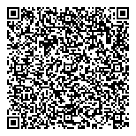

```plain
VR 0: C=CZ,ID=xk66fb65wcyr2zus8hc5b3wdher2ms4g,ISS=Ministry of Health of the Czech Republic
KID: e4lH6I4iMIM=
Issued At: 2021-06-06 14:24:13 UTC
Signed By: CN=CZ DSC 1,O=MZCR,C=CZ (issued by: CN=CZ DSC CSCA 1,O=MZCR,C=CZ)
Expiration: 2022-06-06 14:24:13 UTC
Personal Name: LUKÁŠ SVÁROVSKÝ
DOB: 1980-09-17
```

## samples/leaked/023.txt:

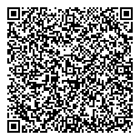

```plain
Certificate is INVALID!
level=fatal msg="unable to verify certificate: public key for kid=2Rk3X8HntrI= not found"
---
VR 0: C=AT,ID=URN:UVCI:01:AT:10807843F94AEE0EE5093FBC254BD813#B,ISS=Ministry of Health, Austria
KID: 2Rk3X8HntrI=
Issued At: 2021-07-05 21:56:09 UTC
Expiration: 2022-07-05 21:56:09 UTC
Personal Name: Gabriele Musterfrau-Gößinger
DOB: 1998-02-26
```

## samples/leaked/024.txt:

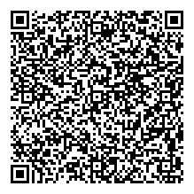

```plain
VR 0: C=EE,ID=01/EE/TIS/W5155EJF1VV5RI8HWX#2,ISS=TIS
KID: EzYR1uk/E0I=
Issued At: 2021-06-22 10:20:20 UTC
Signed By: SERIALNUMBER=02-2021,CN=02-2021_DCC,OU=Health and Welfare Information Systems Centre,O=Estonia,C=EE (issued by: SERIALNUMBER=01-2020,CN=CSCA_Estonia,OU=Police and Border Guard Board,O=Estonia,C=EE)
Expiration: 2021-12-19 10:20:20 UTC
Personal Name: ANDRES PULVER
DOB: 1965-06-12
```

## samples/leaked/025.txt:

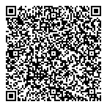

```plain
VR 0: C=EE,ID=01/EE/TIS/BST06PD2NG8Y0NBFXL#Q,ISS=TIS
KID: EzYR1uk/E0I=
Issued At: 2021-06-10 06:21:52 UTC
Signed By: SERIALNUMBER=02-2021,CN=02-2021_DCC,OU=Health and Welfare Information Systems Centre,O=Estonia,C=EE (issued by: SERIALNUMBER=01-2020,CN=CSCA_Estonia,OU=Police and Border Guard Board,O=Estonia,C=EE)
Expiration: 2021-12-07 06:21:52 UTC
Personal Name: ALEKSANDR ZABOLOTNÕI
DOB: 1963-07-18
```

## samples/leaked/026.txt:

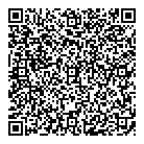

```plain
VR 0: C=EE,ID=01/EE/TIS/7WPV6S37L2OJQNYQHS#C,ISS=TIS
KID: EzYR1uk/E0I=
Issued At: 2021-06-10 09:03:32 UTC
Signed By: SERIALNUMBER=02-2021,CN=02-2021_DCC,OU=Health and Welfare Information Systems Centre,O=Estonia,C=EE (issued by: SERIALNUMBER=01-2020,CN=CSCA_Estonia,OU=Police and Border Guard Board,O=Estonia,C=EE)
Expiration: 2021-12-07 09:03:32 UTC
Personal Name: KADI ANNOM
DOB: 1988-01-19
```

## samples/leaked/027.txt:

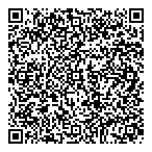

```plain
VR 0: C=ES,ID=01ES11V1D2DB272A808AC50D252C#5,ISS=Servicio Extremeño de Salud
KID: 3IsdmTYkAAM=
Issued At: 2021-06-21 10:36:17 UTC
Signed By: SERIALNUMBER=Q0600413I,CN=Servicio Extremeño de Salud,OU=SELLO ELECTRONICO+OU=SSII,O=Servicio Extremeño de Salud,C=ES,2.5.4.97=#130f56415445532d513036303034313349 (issued by: CN=EADTrust ECC 256 SubCA For Qualified Certificates 2019,OU=Legal Person,O=European Agency of Digital Trust\, S.L.,C=ES,2.5.4.97=#130f56415445532d423835363236323430)
Expiration: 2023-05-27 06:43:00 UTC
Personal Name: AMPARO PARRA NUÑEZ
DOB: 1965-07-09
```

## samples/leaked/028.txt:

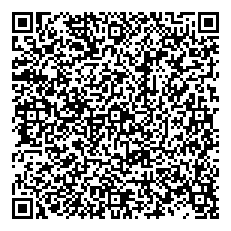

```plain
VR 0: C=ES,ID=01ES16VFC4CA3EAF12AEB3A5FD04#0,ISS=Gobierno Vasco - Eusko Jaurlaritza
KID: GuQPQRxbMsU=
Issued At: 2021-06-09 11:59:29 UTC
Signed By: CN=DIRECCIÓN DE SALUD PÚBLICA Y ADICCIONES,OU=SELLO ELECTRONICO,O=EUSKO JAURLARITZA - GOBIERNO VASCO,C=ES,2.5.4.97=#130f56415445532d533438333330303143 (issued by: CN=iCA Izenpe,OU=Peer,O=IZENPE S.A.,C=ES)
Expiration: 2024-05-28 13:28:12 UTC
Personal Name: MIREN ARANTZA MITXELENA ENBIL
DOB: 1963-01-19
```

## samples/leaked/029.txt:

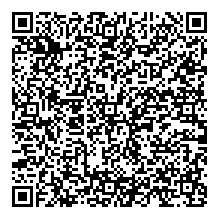

```plain
KID: eQOY6BDp+vM=
Issued At: 2021-07-07 14:17:29 UTC
Signed By: CN=DSC_FR_002,OU=26750045200011,O=APHP,C=FR (issued by: CN=CSCA-FRANCE,O=Gouv,C=FR)
Expiration: 2023-03-24 14:17:29 UTC
Personal Name: Caroline PERDRIX
DOB: 1961-02-13
```

## samples/leaked/030.txt:

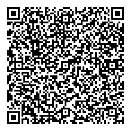

```plain
VR 0: C=BE,ID=01BEBRUBGUCUXJAXELLNIQPODFGW#F,ISS=COCOM-GGC
KID: ODqaG8mnbro=
Issued At: 2021-06-19 02:38:15 UTC
Signed By: CN=Belgium Covid19 DSC 01,O=eHealth - Belgium,C=BE (issued by: CN=Belgium Covid19 Country Signing CA 01,O=eHealth - Belgium,C=BE)
Expiration: 2022-06-18 00:00:00 UTC
Personal Name: Dursun Aydemir
DOB: 1965-01-01
```

## samples/leaked/031.txt:

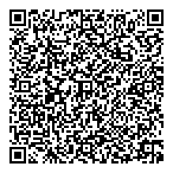

```plain
Certificate is INVALID!
level=fatal msg="unable to verify certificate: public key for kid=XkVWZsKlHnhX not found"
---
VR 0: C=XX,ID=00XX/00000/1234567890/THISISATESTCERTIFICATEXXX#S,ISS=Non Valid Test Certificate
KID: XkVWZsKlHnhX
Issued At: 2021-08-18 07:29:53 UTC
Expiration: 2022-02-14 07:29:53 UTC
Personal Name: John Doe
DOB: 1911-11-11
```
