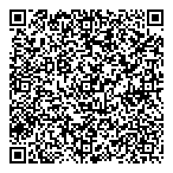
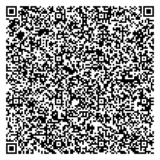
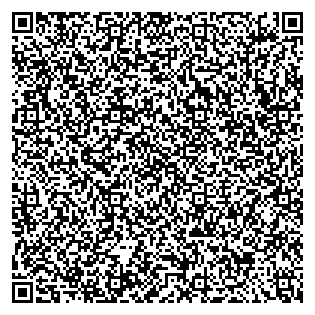
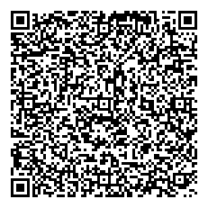
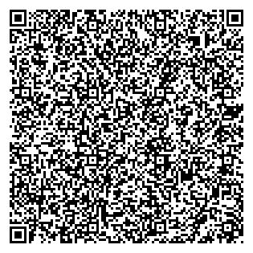
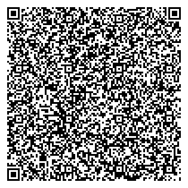
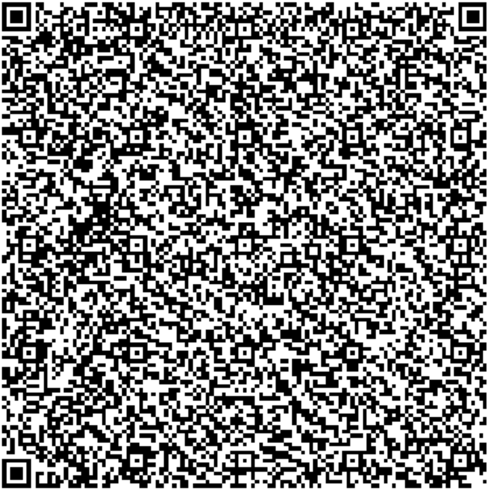

# Results

## samples/bettino-craxi.txt:


```plain
VR 0: C=PL,ID=URN:UVCI:01:PL:1/2A992C33754A4D379A7F61089485BB75,ISS=Centrum e-Zdrowia
KID: HhkeqvrtQ0U=
Issued At: 2021-11-03 17:24:12 UTC
Signed By: CN=Poland Vaccination DGC Service 1,OU=eHealth Centre,O=Ministry of Health,C=PL (issued by: CN=Poland DGC RootCSCA 1,O=Ministry of Health,C=PL)
Expiration: 2023-05-26 11:53:10 UTC
Personal Name: Bettino Craxi
DOB: 1934-02-24
```

## samples/brandenburgtest.txt:


```plain
VR 0: C=DE,ID=URN:UVCI:01DE/IZ14482A/2BYU1VFE8L2JDQJHY1QVSK#E,ISS=Robert Koch-Institut
KID: dhSzPDr4G2M=
Issued At: 2021-05-26 11:29:31 UTC
Signed By: SERIALNUMBER=CSM026164168,CN=Robert Koch-Institut,OU=Elektronischer Impfnachweis,O=Robert Koch-Institut,POSTALCODE=13353,STREET=Nordufer 20,L=Berlin,ST=Berlin,C=DE,2.5.4.97=#131044543a44452d33303233353331343435 (issued by: CN=D-TRUST CA 2-2 2019,O=D-Trust GmbH,C=DE,2.5.4.97=#130e4e545244452d4852423734333436)
Expiration: 2022-05-26 11:29:31 UTC
Personal Name: Bernd Brandenburgtest
DOB: 1950-01-01
```

## samples/hitler-adolf-1900.txt:


```plain
VR 0: C=FR,ID=URN:UVCI:01:FR:T5DWTJYS4ZR8#4,ISS=CNAM
KID: 53FOjX/4aJs=
Issued At: 2021-10-25 22:09:02 UTC
Signed By: CN=DSC_FR_023,OU=180035024,O=CNAM,C=FR (issued by: CN=CSCA-FRANCE,O=Gouv,C=FR)
Expiration: 2023-10-13 22:00:00 UTC
Personal Name: ADOLF HITLER
DOB: 1900-01-01
```

## samples/hitler-adolf-1930.txt:



```plain
VR 0: C=PL,ID=URN:UVCI:01:PL:1/AF2AA5873FAF45DFA826B8A01237BDC4,ISS=Centrum e-Zdrowia
KID: HhkeqvrtQ0U=
Issued At: 2021-10-24 18:08:26 UTC
Signed By: CN=Poland Vaccination DGC Service 1,OU=eHealth Centre,O=Ministry of Health,C=PL (issued by: CN=Poland DGC RootCSCA 1,O=Ministry of Health,C=PL)
Expiration: 2023-05-26 11:53:10 UTC
Personal Name: Adolf Hitler
DOB: 1930-01-01
```

## samples/hitler-adolf-1989.txt:



```plain
Certificate is INVALID!
level=fatal msg="unable to verify certificate: public key for kid=KjE8h58xh7A= not found"
---
VR 0: C=AT,ID=URN:UVCI:V1:MK:SJ27BEBYCOASY3V8PMW0ES5N54,ISS=Ministry of Health
KID: KjE8h58xh7A=
Issued At: 2021-10-27 14:50:25 UTC
Expiration: 2022-09-20 00:00:00 UTC
Personal Name: Adolf Hitler
DOB: 1989-10-20
```

## samples/mama-joe-1990.txt:



```plain
Certificate is INVALID!
level=fatal msg="unable to verify certificate: public key for kid=KjE8h58xh7A= not found"
---
VR 0: C=ZW,ID=URN:UVCI:V1:MK:1BMGOUJNOVI7IRQNBNO04HUMQ1,ISS=Joe
KID: KjE8h58xh7A=
Issued At: 2021-10-27 13:57:54 UTC
Expiration: 2022-10-27 00:00:00 UTC
Personal Name: Joe Mama
DOB: 1990-01-01
```

## samples/mickeymouse.txt:


```plain
VR 0: C=FR,ID=URN:UVCI:01:FR:W7V2BE46QSBJ#L,ISS=CNAM
KID: 53FOjX/4aJs=
Issued At: 2021-10-27 11:20:48 UTC
Signed By: CN=DSC_FR_023,OU=180035024,O=CNAM,C=FR (issued by: CN=CSCA-FRANCE,O=Gouv,C=FR)
Expiration: 2023-10-13 22:00:00 UTC
Personal Name: MICKEY MOUSE
DOB: 2001-12-31
```

## samples/rokotepassieu.txt:



```plain
VR 0: C=DE,ID=URN:UVCI:01DE/A80013335/TCXSI5Q08B0DIJGMIZJDF#T,ISS=Robert Koch-Institut
KID: XkVWZqUeeFc=
Issued At: 2021-10-17 20:19:44 UTC
Signed By: SERIALNUMBER=CSM026460026,CN=Robert Koch-Institut,OU=Elektronischer Impfnachweis,O=Robert Koch-Institut,POSTALCODE=13353,STREET=Nordufer 20,L=Berlin,ST=Berlin,C=DE,2.5.4.97=#131044543a44452d33303233353331343435 (issued by: CN=D-TRUST CA 2-2 2019,O=D-Trust GmbH,C=DE,2.5.4.97=#130e4e545244452d4852423734333436)
Expiration: 2022-10-17 20:19:44 UTC
Personal Name: Ota Yhteyttä Wickr Rokotepassieu
DOB: 1917-12-06
```

## samples/spongebob2.txt:



```plain
Certificate is INVALID!
level=fatal msg="unable to verify certificate: public key for kid=KjE8h58xh7A= not found"
---
VR 0: C=GB,ID=URN:UVCI:V1:MK:S98KWT17050MEGUGPLGDV2H0CV,ISS=Ministry of Health
KID: KjE8h58xh7A=
Issued At: 2021-10-27 14:28:45 UTC
Expiration: 2022-09-27 00:00:00 UTC
Personal Name: Spongebob Squarepants
DOB: 1900-10-01
```

## samples/squarepants-spongebob-1900.txt:



```plain
Certificate is INVALID!
level=fatal msg="unable to verify certificate: public key for kid=KjE8h58xh7A= not found"
---
VR 0: C=GB,ID=URN:UVCI:V1:MK:BB6UIUYRSQK21J4MJTD80SYC9H,ISS=Ministry of Health
KID: KjE8h58xh7A=
Issued At: 2021-10-27 14:12:11 UTC
Expiration: 2022-10-27 00:00:00 UTC
Personal Name: Spongebob Squarepants
DOB: 1900-10-01
```

## samples/xiloe-test.txt:



```plain
Certificate is INVALID!
level=fatal msg="unable to verify certificate: public key for kid=KjE8h58xh7A= not found"
---
VR 0: C=ZW,ID=URN:UVCI:V1:MK:G8EABCNADUKBX07RTNJDBSGSGP,ISS=Xiloe
KID: KjE8h58xh7A=
Issued At: 2021-10-27 23:19:29 UTC
Expiration: 2022-10-27 00:00:00 UTC
Personal Name: Xiloe test
DOB: 1990-01-01
```
